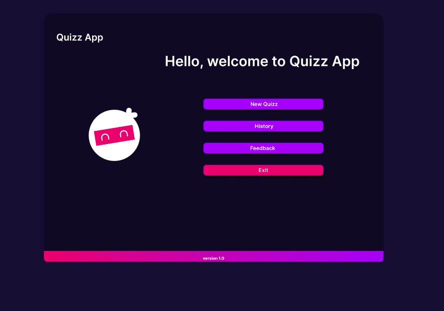
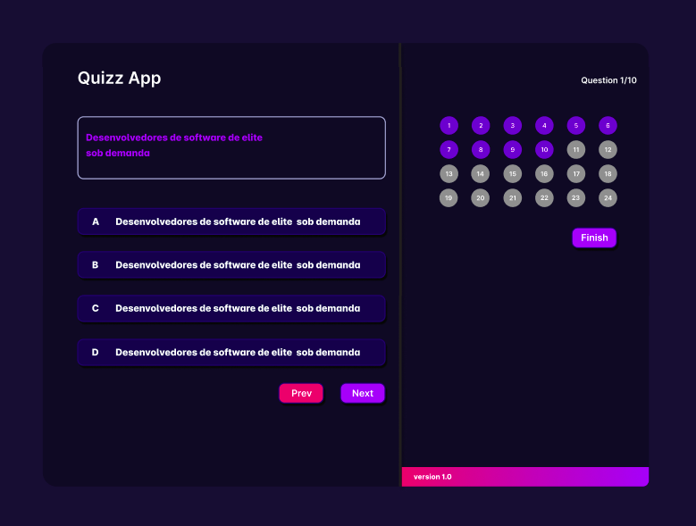
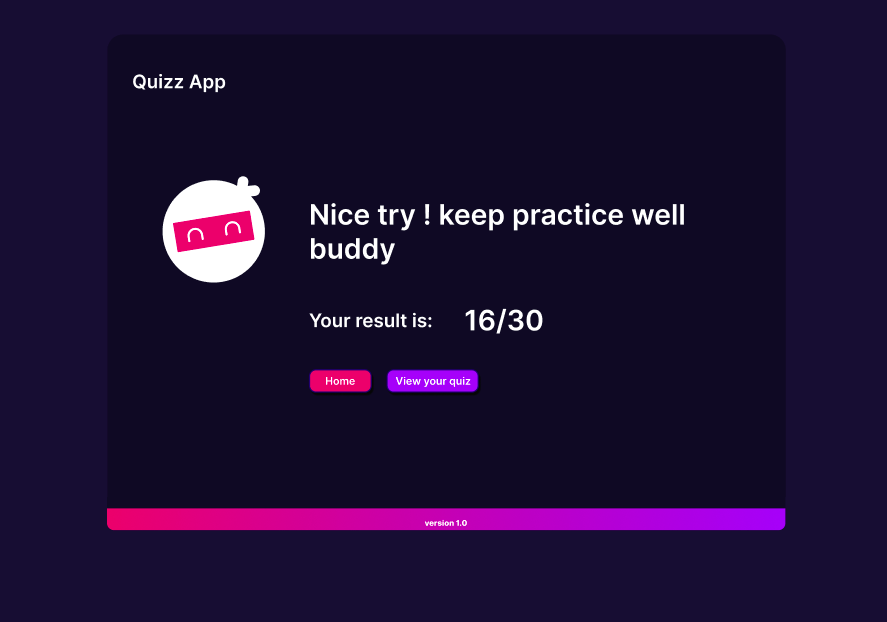
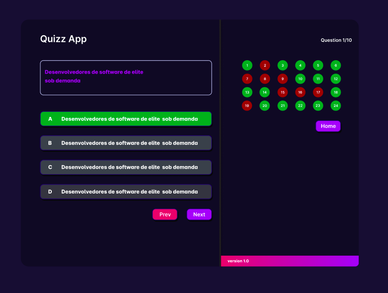
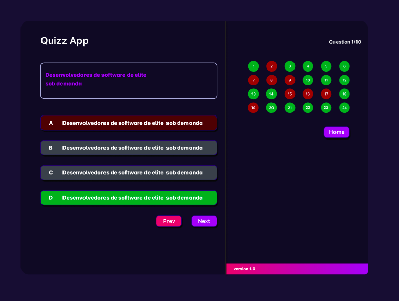
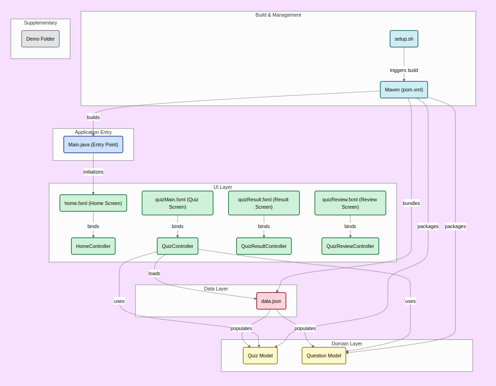

# Quiz App

A simple JavaFX-based quiz application that allows users to take quizzes, view results, and review answers.🤩🤩🤩  

## 📦 Project Information

- **Group ID**: `com.example`
- **Artifact ID**: `quiz-app`
- **Version**: `1.0-SNAPSHOT`
- **Java Version**: 11
- **JavaFX Version**: 17.0.1

### 🧩 Dependencies

- `javafx-controls`
- `javafx-fxml`
- `Gson` (Google JSON library)
- `Jackson Databind` (for JSON processing)


###### Setup program and usage.

# For linux user

1. Install maven

```sh
sudo apt install maven
```

check the maven version

```sh
mvn -v
```

2. Run project

```sh
bash setup.sh
```
# For Window user
    Setup instructions are currently in development.
# For Mac user
    Setup instructions are currently in development.


### Program preview
1. Home ui
   
2. Quiz section
   
3. Result section
   *result page:
   
   *reviewing question:
   
   


# Core
```
    -Java 11

    -JavaFX (17.0.1)

    -Gson

    -Jackson Databind

    -Maven
```

# Project diagram 


    

## Commit
    If you find this project inspiring or helpful, feel free to give the repository a star ⭐️!

## 📄 License

This project is licensed under the [MIT License](LICENSE). Feel free to use and modify it!

